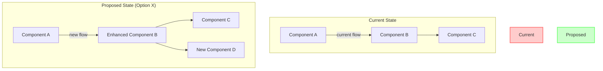
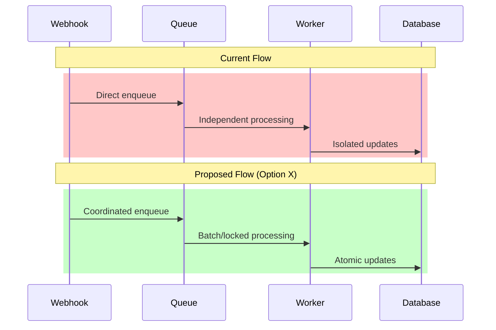

# Research Planning

Create a new research document in a task-specific subdirectory under `docs/specs/` to investigate the `Research Topic` using the exact specified markdown `Research Format`. Follow the `Instructions` to create the research document focusing entirely on architecture and design without implementation planning.

## Instructions

- You're conducting research to understand the problem space and propose architectural solutions without implementing them.
- MANDATORY FIRST STEP: Read and understand `AGENTS.md` for product context and codebase structure.
- Create a task-specific subdirectory in `docs/specs/` named after the research topic (use kebab-case).
- Create the main research document as `RESEARCH.md` in that subdirectory.
- Additional related documents (e.g., `IMPLEMENTATION_PLAN.md`) will be added to the same subdirectory later.
- Use the research format below to create the document.
- Review existing architecture documentation in areas that would be impacted by this task.
- IMPORTANT: Replace every <placeholder> in the `Research Format` with the requested value. Add detail as needed.
- Use your reasoning model: THINK HARD about the task prompt and whether it should be broken down into subtasks.
- IMPORTANT: For each task/subtask, identify at least 3 different architectures or design patterns.
- IMPORTANT: Present multiple options with objective pros/cons - don't make unilateral decisions.
- IMPORTANT: This is purely architecture and design research. DO NOT create implementation plans or write code.
- IMPORTANT: Use collapsible sections for detailed content to improve readability.
- IMPORTANT: Include comparison tables for quick option evaluation.
- Keep track of all decisions requiring user input and include them in Open Questions.

## Relevant Files

Focus on the following files for context:
- `AGENTS.md` - **MANDATORY**: Contains product context and codebase structure
- `README.md` - Contains the project overview
- `docs/specs/*` - Contains existing research and specifications
- `specifications/*.md` - Contains implementation specifications
- Architecture documentation in relevant directories
- Existing implementations of similar features for pattern analysis

Research broadly to understand patterns, but respect any specific files mentioned in the research topic.

## Research Format

```md
# Research: <research topic name>

## Executive Summary
<2-3 sentence summary of the problem and recommended solution>

## Problem Statement
<clearly define the specific problem or opportunity being investigated>

## Context & Impact

<details>
<summary>Impacted Systems</summary>

### Current Implementation
<describe ONLY the aspects of current system that are directly relevant to this task>

### Components Affected
- <component 1>: <how it's affected>
- <component 2>: <how it's affected>

</details>

## Solution Options Overview

| Option | Description | Complexity | Performance Impact | Risk Level | Recommendation |
|--------|-------------|------------|-------------------|------------|----------------|
| **Option 1: <name>** | <1-line description> | Low/Med/High | Low/Med/High | Low/Med/High | ✅ Recommended / ❌ Not Recommended |
| **Option 2: <name>** | <1-line description> | Low/Med/High | Low/Med/High | Low/Med/High | ✅ Recommended / ❌ Not Recommended |
| **Option 3: <name>** | <1-line description> | Low/Med/High | Low/Med/High | Low/Med/High | ✅ Recommended / ❌ Not Recommended |

### Quick Comparison

| Criteria | Option 1 | Option 2 | Option 3 |
|----------|----------|----------|----------|
| **Implementation Time** | <estimate> | <estimate> | <estimate> |
| **Maintenance Burden** | <assessment> | <assessment> | <assessment> |
| **Scalability** | <assessment> | <assessment> | <assessment> |
| **Key Trade-off** | <main trade-off> | <main trade-off> | <main trade-off> |

## Detailed Analysis

<details>
<summary>Option 1: <name></summary>

### Technical Approach
<detailed technical description of how this would work>

### Implementation Details
- <specific technical detail 1>
- <specific technical detail 2>
- <specific technical detail 3>

### Pros
- ✅ <advantage 1 with explanation>
- ✅ <advantage 2 with explanation>
- ✅ <advantage 3 with explanation>

### Cons
- ❌ <disadvantage 1 with explanation>
- ❌ <disadvantage 2 with explanation>
- ❌ <disadvantage 3 with explanation>

### Example Code Structure (Conceptual)
```python
# Pseudocode showing the pattern, not implementation
class ConceptualStructure:
    def approach_pattern():
        # How this pattern would work
        pass
```

</details>

<details>
<summary>Option 2: <name></summary>

### Technical Approach
<detailed technical description of how this would work>

### Implementation Details
- <specific technical detail 1>
- <specific technical detail 2>
- <specific technical detail 3>

### Pros
- ✅ <advantage 1 with explanation>
- ✅ <advantage 2 with explanation>
- ✅ <advantage 3 with explanation>

### Cons
- ❌ <disadvantage 1 with explanation>
- ❌ <disadvantage 2 with explanation>
- ❌ <disadvantage 3 with explanation>

### Example Code Structure (Conceptual)
```python
# Pseudocode showing the pattern, not implementation
class ConceptualStructure:
    def approach_pattern():
        # How this pattern would work
        pass
```

</details>

<details>
<summary>Option 3: <name></summary>

### Technical Approach
<detailed technical description of how this would work>

### Implementation Details
- <specific technical detail 1>
- <specific technical detail 2>
- <specific technical detail 3>

### Pros
- ✅ <advantage 1 with explanation>
- ✅ <advantage 2 with explanation>
- ✅ <advantage 3 with explanation>

### Cons
- ❌ <disadvantage 1 with explanation>
- ❌ <disadvantage 2 with explanation>
- ❌ <disadvantage 3 with explanation>

### Example Code Structure (Conceptual)
```python
# Pseudocode showing the pattern, not implementation
class ConceptualStructure:
    def approach_pattern():
        # How this pattern would work
        pass
```

</details>

## Architecture Diagrams

### Current State vs Proposed Changes



### Data Flow Comparison



## Recommendation

### Primary Recommendation: <option name>
<2-3 sentences explaining why this option is recommended>

### Rationale
1. **<key reason 1>**: <explanation>
2. **<key reason 2>**: <explanation>
3. **<key reason 3>**: <explanation>

### Trade-offs Accepted
- <trade-off 1 and why it's acceptable>
- <trade-off 2 and why it's acceptable>

## Infrastructure & Dependencies

<details>
<summary>Requirements</summary>

### New Dependencies
- <dependency 1>: <purpose and impact>
- <dependency 2>: <purpose and impact>

### Infrastructure Changes
- <change 1>: <description and scale>
- <change 2>: <description and scale>

### Performance Considerations
- <consideration 1>
- <consideration 2>

</details>

## Risks & Mitigation

| Risk | Impact | Probability | Mitigation Strategy |
|------|--------|-------------|-------------------|
| <risk 1> | High/Med/Low | High/Med/Low | <mitigation approach> |
| <risk 2> | High/Med/Low | High/Med/Low | <mitigation approach> |
| <risk 3> | High/Med/Low | High/Med/Low | <mitigation approach> |

## Open Questions

1. **<question category>**: <specific question needing user input>
2. **<question category>**: <specific question needing user input>
3. **<question category>**: <specific question needing user input>

## Next Steps

1. [ ] Get approval on recommended approach
2. [ ] <specific next action>
3. [ ] <specific next action>
4. [ ] Create detailed implementation plan

## Appendix

<details>
<summary>Additional Research Notes</summary>

### Related Patterns in Codebase
<patterns found during research>

### External References
<useful external resources or documentation>

### Alternative Approaches Considered
<brief notes on approaches that were considered but not fully developed>

</details>
```

## Research Topic
$ARGUMENTS