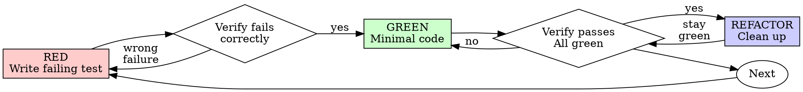

# Test-Driven Development (TDD)

## Overview

Write the test first. Watch it fail. Write minimal code to pass.

**Core principle:** If you didn't watch the test fail, you don't know if it tests the right thing.

**Violating the letter of the rules is violating the spirit of the rules.**

## Commands Used by This Skill

**TDD runs ONLY the specific test being written:**
```bash
# Unit tests
cd api && just test-unit "tests/unit/test_file.py::test_name -v"

# Integration tests
cd api && just test-integration "tests/integration/test_file.py::test_name -v"

# E2E mocked tests
cd api && just test-e2e "tests/e2e_mocked/test_file.py::test_name -v"

# Lint + type checking (after GREEN)
cd api && just lint-and-fix
```

**TDD does NOT run:**
- ❌ `just test-all-mocked` (full test suite)
- ❌ `.claude/skills/test-runner/scripts/run_tests_parallel.sh` (all suites)
- ❌ Any comprehensive test commands

**Why?** TDD focuses on the specific test being written. The **test-runner skill** handles comprehensive testing after TDD is complete.

## When to Use

**Always:**
- New features
- Bug fixes
- Refactoring
- Behavior changes

**Exceptions (ask your human partner):**
- Throwaway prototypes
- Generated code
- Configuration files

Thinking "skip TDD just this once"? Stop. That's rationalization.

## The Iron Law

```
NO PRODUCTION CODE WITHOUT A FAILING TEST FIRST
```

Write code before the test? Delete it. Start over.

**No exceptions:**
- Don't keep it as "reference"
- Don't "adapt" it while writing tests
- Don't look at it
- Delete means delete

Implement fresh from tests. Period.

## Red-Green-Refactor



### RED - Write Failing Test

Write one minimal test showing what should happen.

<Good>
```python
def test_retries_failed_operations_3_times():
    """Test that retry mechanism attempts 3 times before giving up."""
    attempts = []

    def operation():
        attempts.append(1)
        if len(attempts) < 3:
            raise ValueError("fail")
        return "success"

    result = retry_operation(operation)

    assert result == "success"
    assert len(attempts) == 3
```
Clear name, tests real behavior, one thing
</Good>

<Bad>
```python
def test_retry_works():
    """Vague test with mock."""
    mock = Mock()
    mock.side_effect = [ValueError(), ValueError(), "success"]

    retry_operation(mock)

    assert mock.call_count == 3
```
Vague name, tests mock not code
</Bad>

**Requirements:**
- One behavior
- Clear name
- Real code (no mocks unless unavoidable)

### Verify RED - Watch It Fail

**MANDATORY. Never skip.**

```bash
# Run ONLY the test you just wrote (use appropriate command for test type)
cd api && just test-unit "tests/unit/test_retry.py::test_retries_failed_operations_3_times -v"
# Or: just test-integration "tests/integration/..."
# Or: just test-e2e "tests/e2e_mocked/..."
```

Confirm:
- Test fails (not errors)
- Failure message is expected
- Fails because feature missing (not typos)

**Test passes?** You're testing existing behavior. Fix test.

**Test errors?** Fix error, re-run until it fails correctly.

### GREEN - Minimal Code

Write simplest code to pass the test.

<Good>
```python
def retry_operation(fn):
    """Retry operation up to 3 times."""
    for i in range(3):
        try:
            return fn()
        except Exception as e:
            if i == 2:
                raise
```
Just enough to pass
</Good>

<Bad>
```python
def retry_operation(
    fn,
    max_retries: int = 3,
    backoff: str = 'linear',
    on_retry: callable | None = None,
    exceptions: tuple = (Exception,),
):
    # YAGNI - over-engineered
    ...
```
Over-engineered
</Bad>

Don't add features, refactor other code, or "improve" beyond the test.

### Verify GREEN - Watch It Pass

**MANDATORY.**

```bash
# 1. Run the specific test you wrote (use appropriate command for test type)
cd api && just test-unit "tests/unit/test_retry.py::test_retries_failed_operations_3_times -v"
# Or: just test-integration "tests/integration/..."
# Or: just test-e2e "tests/e2e_mocked/..."

# 2. Run lint + type checking (catches syntax/type issues immediately)
cd api && just lint-and-fix
```

Confirm:
- Test passes
- Lint and mypy pass
- Output pristine (no errors, warnings)

**Test fails?** Fix code, not test.

**Lint/mypy fails?** Fix immediately before continuing.

**NOTE:** Do NOT run the full test suite here. The **test-runner skill** handles comprehensive testing after TDD is complete.

### REFACTOR - Clean Up

After green only:
- Remove duplication
- Improve names
- Extract helpers

Keep tests green. Don't add behavior.

### Repeat

Next failing test for next feature.

## Good Tests

| Quality | Good | Bad |
|---------|------|-----|
| **Minimal** | One thing. "and" in name? Split it. | `def test_validates_email_and_domain_and_whitespace():` |
| **Clear** | Name describes behavior | `def test_1():` |
| **Shows intent** | Demonstrates desired API | Obscures what code should do |

## Why Order Matters

**"I'll write tests after to verify it works"**

Tests written after code pass immediately. Passing immediately proves nothing:
- Might test wrong thing
- Might test implementation, not behavior
- Might miss edge cases you forgot
- You never saw it catch the bug

Test-first forces you to see the test fail, proving it actually tests something.

**"I already manually tested all the edge cases"**

Manual testing is ad-hoc. You think you tested everything but:
- No record of what you tested
- Can't re-run when code changes
- Easy to forget cases under pressure
- "It worked when I tried it" ≠ comprehensive

Automated tests are systematic. They run the same way every time.

**"Deleting X hours of work is wasteful"**

Sunk cost fallacy. The time is already gone. Your choice now:
- Delete and rewrite with TDD (X more hours, high confidence)
- Keep it and add tests after (30 min, low confidence, likely bugs)

The "waste" is keeping code you can't trust. Working code without real tests is technical debt.

**"TDD is dogmatic, being pragmatic means adapting"**

TDD IS pragmatic:
- Finds bugs before commit (faster than debugging after)
- Prevents regressions (tests catch breaks immediately)
- Documents behavior (tests show how to use code)
- Enables refactoring (change freely, tests catch breaks)

"Pragmatic" shortcuts = debugging in production = slower.

**"Tests after achieve the same goals - it's spirit not ritual"**

No. Tests-after answer "What does this do?" Tests-first answer "What should this do?"

Tests-after are biased by your implementation. You test what you built, not what's required. You verify remembered edge cases, not discovered ones.

Tests-first force edge case discovery before implementing. Tests-after verify you remembered everything (you didn't).

30 minutes of tests after ≠ TDD. You get coverage, lose proof tests work.

## Common Rationalizations

| Excuse | Reality |
|--------|---------|
| "Too simple to test" | Simple code breaks. Test takes 30 seconds. |
| "I'll test after" | Tests passing immediately prove nothing. |
| "Tests after achieve same goals" | Tests-after = "what does this do?" Tests-first = "what should this do?" |
| "Already manually tested" | Ad-hoc ≠ systematic. No record, can't re-run. |
| "Deleting X hours is wasteful" | Sunk cost fallacy. Keeping unverified code is technical debt. |
| "Keep as reference, write tests first" | You'll adapt it. That's testing after. Delete means delete. |
| "Need to explore first" | Fine. Throw away exploration, start with TDD. |
| "Test hard = design unclear" | Listen to test. Hard to test = hard to use. |
| "TDD will slow me down" | TDD faster than debugging. Pragmatic = test-first. |
| "Manual test faster" | Manual doesn't prove edge cases. You'll re-test every change. |
| "Existing code has no tests" | You're improving it. Add tests for existing code. |

## Red Flags - STOP and Start Over

- Code before test
- Test after implementation
- Test passes immediately
- Can't explain why test failed
- Tests added "later"
- Rationalizing "just this once"
- "I already manually tested it"
- "Tests after achieve the same purpose"
- "It's about spirit not ritual"
- "Keep as reference" or "adapt existing code"
- "Already spent X hours, deleting is wasteful"
- "TDD is dogmatic, I'm being pragmatic"
- "This is different because..."

**All of these mean: Delete code. Start over with TDD.**

## Example: Bug Fix

**Bug:** Empty email accepted

**RED**
```python
def test_rejects_empty_email():
    """Form submission should reject empty email."""
    result = submit_form({"email": ""})

    assert result["error"] == "Email required"
```

**Verify RED**
```bash
$ cd api && just test-unit "tests/unit/test_form.py::test_rejects_empty_email -v"
FAILED: AssertionError: assert None == 'Email required'
```

**GREEN**
```python
def submit_form(data: dict) -> dict:
    """Submit form data with validation."""
    email = data.get("email", "").strip()
    if not email:
        return {"error": "Email required"}
    # ...
```

**Verify GREEN**
```bash
$ cd api && just test-unit "tests/unit/test_form.py::test_rejects_empty_email -v"
PASSED

$ cd api && just lint-and-fix
✅ All linting checks passed!
```

**REFACTOR**
Extract validation for multiple fields if needed.

## Verification Checklist

Before marking TDD work complete:

- [ ] Every new function/method has a test
- [ ] Watched each test fail before implementing
- [ ] Each test failed for expected reason (feature missing, not typo)
- [ ] Wrote minimal code to pass each test
- [ ] Specific tests pass (`just test-unit/integration/e2e "path/to/test.py::test_name"`)
- [ ] Lint and mypy pass (`just lint-and-fix`)
- [ ] Tests use real code (mocks only if unavoidable)
- [ ] Edge cases and errors covered

Can't check all boxes? You skipped TDD. Start over.

**NOTE:** This checklist is for the TDD cycle only. Use **test-runner skill** for comprehensive testing (full test suite, all mocked tests, etc.) before committing.

## When Stuck

| Problem | Solution |
|---------|----------|
| Don't know how to test | Write wished-for API. Write assertion first. Ask your human partner. |
| Test too complicated | Design too complicated. Simplify interface. |
| Must mock everything | Code too coupled. Use dependency injection. |
| Test setup huge | Extract helpers. Still complex? Simplify design. |

## Debugging Integration

Bug found? Write failing test reproducing it. Follow TDD cycle. Test proves fix and prevents regression.

Never fix bugs without a test.

---

## E2E / Frontend Tests (Playwright)

**TDD applies to frontend too.** The same Red-Green-Refactor cycle works with Playwright E2E tests.

### When to Use E2E Tests

| Change Type | Test Type |
|-------------|-----------|
| Backend logic, API, services | pytest (unit/integration) |
| UI components, user flows | Playwright (E2E) |
| Full feature (backend + frontend) | Both |

### E2E TDD Cycle

**RED - Write Failing E2E Test**

```typescript
// tests/e2e/specs/upload-recording.spec.ts
test('user can upload a recording', async ({ page }) => {
  const dashboard = new DashboardPage(page);
  await dashboard.goto();

  const recordingId = await dashboard.uploadRecording('test-audio.wav');

  expect(recordingId).toBeTruthy();
  await expect(page.getByText('Upload complete')).toBeVisible();
});
```

**Verify RED**

```bash
just e2e-smoke
# FAILED: Expected "Upload complete" to be visible
```

Confirm test fails because feature is missing, not due to typos or selector issues.

**GREEN - Implement Until Test Passes**

Implement the minimal code (backend + frontend) to make the test pass.

**Verify GREEN**

```bash
just e2e-smoke
# PASSED
```

**REFACTOR** - Clean up, then verify tests still pass.

### E2E Test Commands

```bash
# Run smoke tests (fast, 1-2 files)
just e2e-smoke

# Run all E2E tests (slow, full coverage)
just e2e

# Run specific test file
cd tests/e2e && npx playwright test specs/upload.spec.ts

# Debug with UI
cd tests/e2e && npx playwright test --ui
```

### E2E Test Structure

Tests live in `tests/e2e/` with Page Object pattern:

```
tests/e2e/
├── pages/           # Page Objects (selectors + actions)
├── flows/           # Reusable multi-page flows
├── specs/           # Actual test files
└── fixtures/        # Test data
```

### Common E2E Mistakes

| Mistake | Fix |
|---------|-----|
| Test passes immediately | You're testing existing behavior. Write test for NEW behavior. |
| Flaky selectors | Use `data-testid` attributes, not CSS classes. |
| Tests too slow | Use smoke tests for TDD cycle, full suite before commit. |
| Skipping RED phase | You must see it fail first. No exceptions. |

### E2E + Backend Integration

When implementing a full feature:

1. **Start with E2E test** - Defines the user-facing behavior
2. **Watch it fail** - Probably fails because backend doesn't exist
3. **Drop to unit tests** - Write pytest tests for backend logic
4. **Implement backend** - Until pytest passes
5. **Implement frontend** - Until E2E test passes
6. **Run lint** - `cd api && just lint-and-fix`

This ensures both backend logic AND user experience are tested.

**NOTE:** Use **test-runner skill** for comprehensive testing after TDD is complete.

---

## Final Rule

```
Production code → test exists and failed first
Otherwise → not TDD
```

No exceptions without your human partner's permission.
